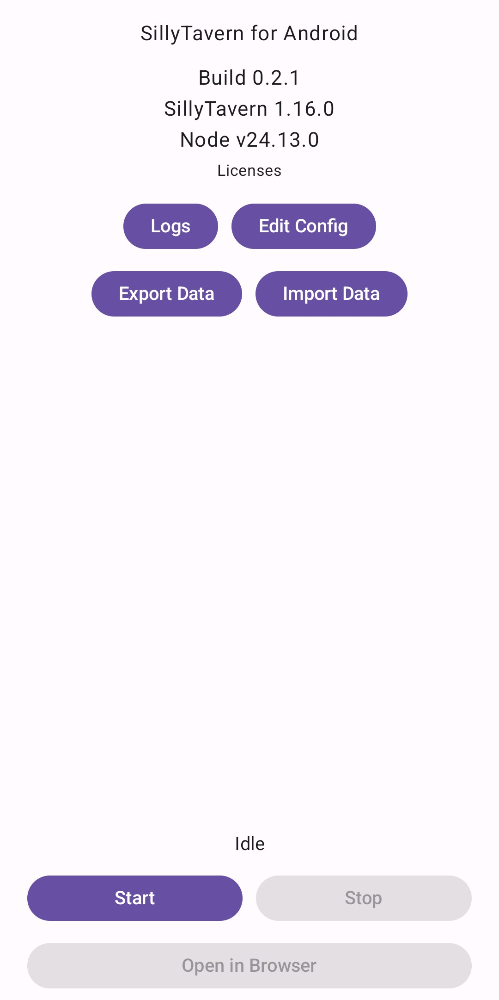

# ST-android

SillyTavern app for Android. Works on device with zero setup. Supports Android 8.0+ and arm64.



This is a personal project and is not affiliated with or endorsed by SillyTavern.
It is intended primarily for basic on-device chatting; advanced workflows (for example, some extensions) may not work.

## Privacy

- The app makes no network requests beyond what SillyTavern itself does.
- No telemetry of any kind.
- Unlike Termux, app works in Private Space/Secure Folder/Secondary profiles.
- All chats, characters, settings stay local unless you decide to export them manually and share with others.
- Bundles SillyTavern source code without modifications.
- Bundles Node.js with minimal patches required to run on Android.
- The codebase is intentionally small and easy to review manually or with a coding agent.
- Release APKs are built in the pipeline and published automatically through immutable releases.

## Changelog

See `CHANGELOG.md`.

## Build (Docker)

Prereqs: Docker installed (plus Git for cloning the repo). Tested only on Linux.

```bash
git clone <repo>
cd ST-android
git submodule update --init --recursive
./ci/scripts/build_apk_docker.sh
```

Output:
- `app/build/outputs/apk/debug/app-debug.apk`
