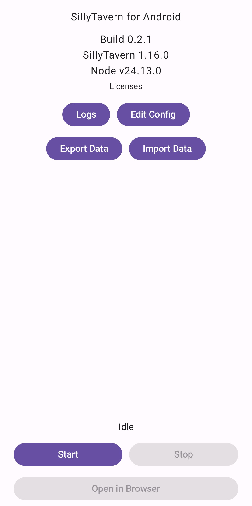

# ST-android

SillyTavern runner for Android. Works on device with zero setup. Supports Android 8.0+ and arm64.




This is a personal project and is not affiliated with or endorsed by SillyTavern.
It is intended primarily for basic on-device chatting. Extensions are not properly supported yet.

## Privacy

- No telemetry of any kind.
- Unlike Termux, the app works in Private Space/Secure Folder/Secondary profiles.
- Minimal network calls: opt-in GitHub release checks, npm installs, and GitHub downloads for custom ST versions. All other traffic comes from SillyTavern itself.
- All chats, characters, settings stay local unless you decide to export them manually and share with others.
- Bundles SillyTavern source code without modifications.
- Bundles Node.js with minimal patches required to run on Android.
- Release APKs are built in the pipeline and published automatically through immutable releases.

## Features

- Runs SillyTavern in one click
- Properly asks and checks for permissions
- Has an import/export system; supports the app's own archive format and archives produced by the SillyTavern UI
- Easily change SillyTavern: any version, branch, repo, or install from a ZIP archive. Not guaranteed to be compatible with something very exotic/outdated.
- Dark/light mode support
- Automatically opens the browser
- Optional access to the SillyTavern data folder through external file managers.

## Installation

Download the APK from [Releases](https://github.com/Sanitised/ST-android/releases/latest) (allow installs from your browser/files app if Android asks).

## Transferring data from SillyTavern on Termux/PC

The app accepts `.tar.gz`, `.tar`, and `.zip` archives. The file format is detected automatically.

The app supports two archive types: full backups exported from this app and SillyTavern user backups.

Full backups produced by this app save more information and are generally recommended, especially for reinstalls.

### Use SillyTavern user backups for data transfer

In your old installation of SillyTavern, press **User Settings**, **Account**, **Download Backup**.

Then stop the server in the app, tap **Manage ST**, **Import Data** and select the backup archive (for example, `default-user-20260303-122334.zip`).

This method is the easiest, and will import all your chats, characters, and other user data. It won't work properly for multi-user setups, and it won't transfer the server config.

### Quick full backup for data transfer (Termux or Linux)

Run this one-liner:

```bash
bash <(curl -sSf https://raw.githubusercontent.com/Sanitised/ST-android/master/tools/export_to_st_android.sh)
```
If your SillyTavern folder is not in a standard location, first do `cd ./my-sillytavern`.

Then stop the server in the app, tap **Manage ST**, **Import Data** and select the backup archive (for example, `st_backup.tar.gz`).

### Making full data backup manually for data transfer

The archive must have this structure:

```
st_backup/
├── config.yaml
└── data/
```

```bash
mkdir st_backup
cp /path/to/sillytavern/config.yaml st_backup/
cp -r /path/to/sillytavern/data st_backup/
tar -czf st_backup.tar.gz st_backup/
```

On Termux, copy the archive to Downloads so the app can reach it:

```bash
termux-setup-storage   # one-time permission grant
cp st_backup.tar.gz ~/storage/downloads/
```

Then stop the server in the app, tap **Manage ST**, **Import Data** and select the backup archive (for example, `st_backup.tar.gz`).

## Changelog

See [CHANGELOG.md](CHANGELOG.md).

## Build (Docker)

Prereqs: Docker installed (plus Git for cloning the repo). Tested only on Linux.

```bash
git clone https://github.com/Sanitised/ST-android
cd ST-android
git submodule update --init --recursive
./ci/scripts/build_apk_docker.sh
```

The first build takes around 2 to 3 hours, compiling Node from scratch. Subsequent builds are a lot faster.

Output:
- `app/build/outputs/apk/debug/app-debug.apk`
